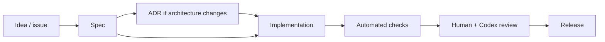

# AI Project Workbench

[](https://github.com/Black0wI/ai-project-workbench/actions/workflows/template-check.yml)
[](LICENSE)
[](AGENTS.md)

Stack-agnostic starter kit for AI-first projects built to work well with Codex, human review, and production delivery.

This repository is intentionally light on framework code. It gives every new project a strong operating system: agent instructions, skills, specs, architecture records, quality gates, and review templates.

Applications created from this workbench are expected to be hosted on AWS. The concrete AWS product is selected per project based on workload needs, with cost effectiveness as a primary criterion and explicit user validation before implementation. DNS is managed systematically through Cloudflare via API. Version control and collaboration are standardized on GitHub. When a relational database is required, PostgreSQL is the default engine.

## What This Template Provides

- Codex-ready repository instructions in `AGENTS.md`
- Repeatable local skills in `.codex/skills`
- Optional SkillKit workflow for discovering, scanning, and managing external skills
- Product and UX constraints in `DESIGN.md`
- DESIGN.md-style design system contract with machine-readable tokens
- Ready-made DESIGN.md presets for common AI product types
- Specification workflow in `SPECS.md`
- Architecture decision records in `docs/adr`
- Feature spec templates in `docs/specs`
- Runbook and architecture documentation placeholders
- GitHub issue and PR templates
- Minimal CI for template validation
- Stack-neutral scripts for validation and bootstrap
- AWS deployment decision framework with cost-effective service selection
- Cloudflare DNS management workflow via API
- GitHub versioning and repository governance workflow
- PostgreSQL-first relational database decision workflow
- Prompt library and minimal eval case format
- Docker, task, and infrastructure templates
- Secrets, cost governance, and IaC decision workflows
- Apache-2.0 license for public reuse
- Public repository polish: badges, NOTICE, issue templates, ADR/spec indexes

## Recommended First Use

1. Copy or generate a new repository from this template.
2. Update `README.md`, `DESIGN.md`, and `AGENTS.md` with project-specific context.
3. Create the first feature spec from `docs/specs/000-template.md`.
4. Record major technical choices in `docs/adr`.
5. Add framework-specific commands to `Makefile` and `scripts/check-template.sh`.
6. Use `docs/runbooks/skill-management.md` before adding external skills.
7. Use `docs/runbooks/aws-deployment-selection.md` before implementing infrastructure.
8. Use `docs/runbooks/cloudflare-dns-management.md` before changing DNS.
9. Use `docs/runbooks/github-versioning.md` before configuring repository governance or releases.
10. Use `docs/runbooks/database-selection.md` before adding persistence.
11. Use `docs/runbooks/design-system-management.md` before changing design tokens or importing Stitch output.
12. Use `docs/runbooks/design-template-selection.md` before applying a ready-made design preset.
13. Use `docs/runbooks/iac-selection.md`, `docs/runbooks/secrets-management.md`, and `docs/runbooks/cost-governance.md` before production infrastructure work.
14. Use `docs/checklists/new-project.md` when instantiating a derived project.

## Repository Map

```text
.
├── .codex/                  # Codex skills and examples
├── .skills/                 # Optional SkillKit manifests and metadata
├── .github/                 # PR and issue workflows
├── docs/
│   ├── adr/                 # Architecture decision records
│   ├── architecture/        # System maps and diagrams
│   ├── runbooks/            # Operational procedures
│   └── specs/               # Product and implementation specs
├── evals/                   # Stack-agnostic eval cases
├── prompts/                 # Versioned prompt artifacts
├── scripts/                 # Local automation hooks
├── templates/               # Reusable project templates
├── AGENTS.md                # Agent operating instructions
├── CONTRIBUTING.md          # Contribution workflow
├── DESIGN.md                # UX/product/design system constraints
├── SECURITY.md              # Security baseline
├── SPECS.md                 # Spec workflow
└── Makefile                 # Common command facade
```

## Core Workflow



## Quality Bar

Every project built from this template should define:

- A clear user or business outcome
- Explicit non-goals
- Security and privacy constraints
- Runtime and deployment assumptions
- AWS service selection rationale and user validation
- Cloudflare DNS records, API token scope, and rollback path
- GitHub repository, branch, PR, release, and protection rules
- PostgreSQL persistence model when relational storage is needed
- DESIGN.md tokens and UX rules for UI work
- Versioned prompts and evals for important AI behavior
- Secrets, cost, and IaC governance when infrastructure is touched
- Fast local checks
- Production readiness criteria

## Checklists

- `docs/checklists/ai-readiness.md`
- `docs/checklists/production-readiness.md`
- `docs/checklists/repository-hardening.md`
- `docs/checklists/skill-review.md`
- `docs/checklists/aws-deployment-review.md`
- `docs/checklists/cloudflare-dns-review.md`
- `docs/checklists/github-repository-review.md`
- `docs/checklists/database-review.md`
- `docs/checklists/design-review.md`
- `docs/checklists/iac-review.md`
- `docs/checklists/secrets-review.md`
- `docs/checklists/cost-review.md`

## Optional SkillKit Workflow

SkillKit can help discover, translate, scan, and manage skills across Codex and other agents. It is intentionally optional and not installed during bootstrap.

```bash
make skills-recommend
make skills-scan
```

Read `docs/runbooks/skill-management.md` before adding external skills.

## Commands

```bash
make help
make check
make doctor
make design-templates
make skills-scan
```

`make new-project-check` is intended for repositories created from this template after project-specific names and placeholder values are replaced.

## Codex Notes

Codex works best when tasks are scoped, files are discoverable, and project rules are explicit. Keep `AGENTS.md`, `DESIGN.md`, and specs current as the system evolves.

For OpenAI/Codex documentation, prefer the official docs MCP server or official OpenAI docs before making model, API, or workflow assumptions.

## License

Licensed under the Apache License, Version 2.0. See `LICENSE`.
